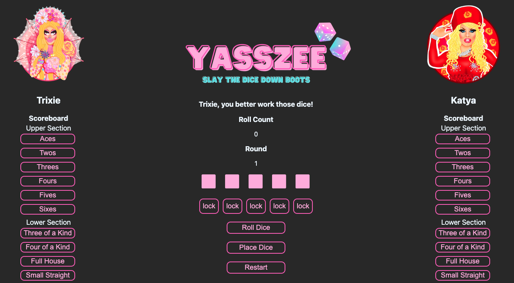

# YASSZEE

## [Play YASSZEE Here](https://yasszee.netlify.app/)

YASSZEE is a RuPaul's Drag Race themed Yahtzee-style game. Both players can choose one of 10 iconic queens to play as. The basics of gameplay are:
* Each player chooses a Drag Race icon to play as; once you select your characters, press start.
* Click the roll dice button up to three times per turn.
* You can lock dice in place by using the lock button between rolls. Once a die is locked, you can unlock it by pressing the lock button again.
* When you're happy with your dice combination (or you finished your third roll), click the place dice button to activate your scoreboard.
* Click on the button for the hand you'd like to count your dice as for that round. Any combination of dice can be placed on any hand, but only valid dice values will be counted toward your score.
* You'll hear the iconic shade rattle at the end of the 13th round, and the game will be over.
* Don't worry about calculating your score; the app will do it for you and add your total score to the bottom of your scoreboard.
* Clicking restart will let you choose new characters and play a fresh game.
* Planning materials and original wireframe can be found [here](https://docs.google.com/document/d/1UA5bBcTm1CF_MG64lcle178ME7TS67oI8M0gUle_5iI/edit?usp=sharing)

## Technologies Used
* JavaScript
* HTML
* CSS
* Git
* Canva

## Credits
* Dice font designed by [Jeff Bensch](https://www.dafont.com/jeff-bensch.d1635)
* Drag art by [RipstirLeon87](https://www.deviantart.com/ripstirleon87)
* Laganja, Aja, Shangela, Herses, Trixie, Alyssa, Latrice, and Katya sounds from [myinstants.com](https://www.myinstants.com)
* Shade sound from [shadebutton.com](http://www.shadebutton.com/)
* Dice rolling sound from freesound.org user [dermotte](https://freesound.org/people/dermotte/)

## Ice Box
- [x] Develop mobile friendly layout and make the design fit on an iPhone
- [ ] Allow more than two players at at time
- [ ] Update functionality so players don't have to sit at the same computer to play
- [ ] Add one-player mode with a computer opponent
